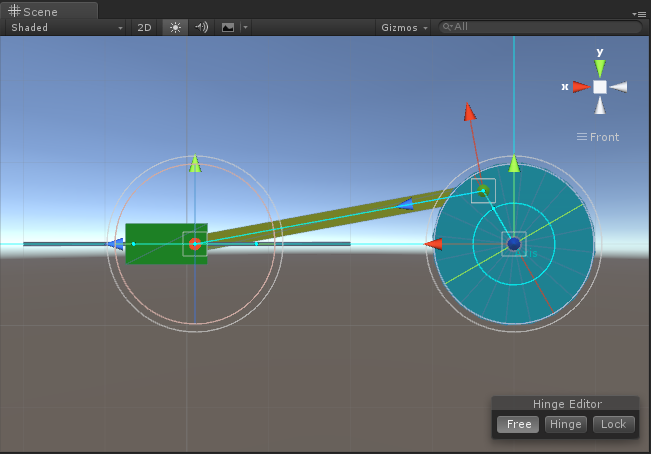
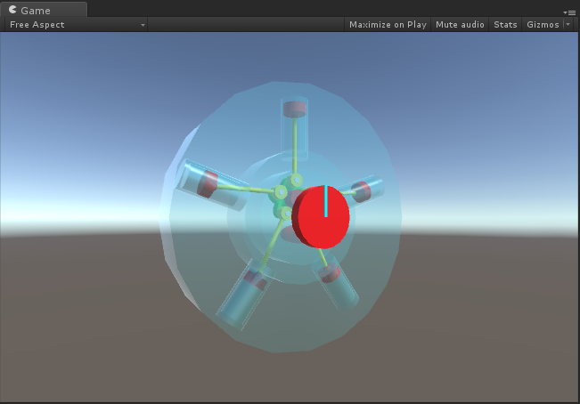
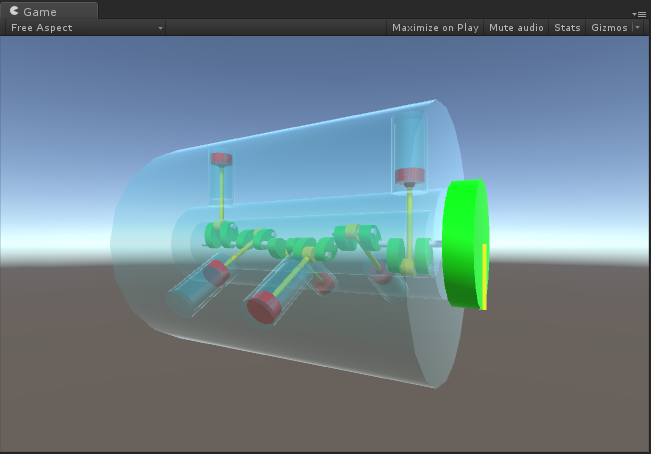
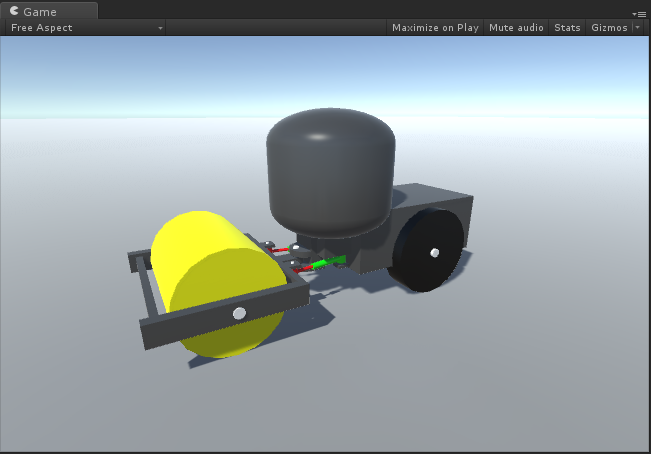
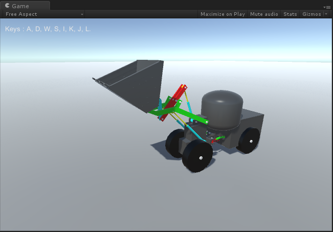

# MGS-Machinery
- [中文手册](./README_ZH.md)

## Summary
- Unity plugin for binding machinery joint in scene.

## Demand
- Binding rotate joints, example: upcar of crane, external gearing and inner gearing.
- Binding telescopic joints, example: big arm and landing legs of crane, waist articulation of road roller.
- Binding hydraulic cylinder.
- Binding crank roker, example: scraper bucket of loader, bucket of excavator.
- Binding crank slider, example: reciprocating engine, aircraft planetary engine.
- Binding complete construction machinery, example crane, road roller, loader, grader and excavator.

## Environment
- Unity 5.0 or above.
- .Net Framework 3.0 or above.

## Achieve
- Mechanism : Define abstract joint, hinge and mechanism.
- VectorExtension : Calculate rotate angle base on normal.
- Planimetry : Define and calculate planimetry.
- FreeCrank : Free rotate around Z axis.
- LimitCrank : Rotate around Z axis in the angle range. 
- CrankRocker : Crank rocker mechanism.
- CrankSlider : Crank slider mechanism.
- RockerHinge : Hinge of roker, rotate around the axis follow roker.
- RockerJoint : Roker joint, always look at target joint.
- RockerLock : Lock of roker, limit the distance range of a pair rokers.
- RockerRivet : Rivet of roker, keep the same position(world space) as the target joint.
- TelescopicJoint : Telescopic joint.
- CeTelescopicJoint : Telescopic joint base on center.
- SeTelescopicArm : Sequence telescopic arm, drive from first joint to last joint.
- SynchroMechanism : Synchronous mechanism, drive multi mechanisms at the same time.
- MeDriver : Universal mechanism driver.

## Demo
- Prefabs in the path "MGS-Machinery/Prefabs" provide reference to you.
- Demos in the path "MGS-Machinery/Scenes" provide reference to you.

## Preview
- CrankRocker

- CrankSlider

- RockerHinge

- InternalGearing

- AirplaneEngine

- GasEngine

- Crane

- RoadRoller

- Loader

- Grader

- Excavator

## Tutorial
- Documentation (Unfinished).
- Video (Unfinished).

## Contact
- If you have any questions, feel free to contact me at mogoson@qq.com.