# MGS-Machinery
- [中文手册](./README_ZH.md)
- [Alibaba Cloud](https://www.aliyun.com/minisite/goods?userCode=0fgf4qk9)

## Summary
- Unity plugin for binding machinery joint in scene.

## Demand
- Binding rotate joints, example: upcar of crane, external gearing and inner gearing.
- Binding slider joints, example: big arm and landing legs of crane, waist articulation of road roller.
- Binding hydraulic cylinder.
- Binding dynamic spring.
- Binding crank roker, example: scraper bucket of loader, bucket of excavator.
- Binding crank slider, example: reciprocating engine, aircraft planetary engine.
- Binding complete construction machinery, example crane, road roller, loader, grader and excavator.
- Binding mesh Gear.
- Binding worm gear.
- Binding belt flywheel.
- Binding vibrator.
- Binding differential.
- Binding transmission.

## Environment
- Unity 5.0 or above.
- .Net Framework 3.0 or above.

## Achieve
- Mechanism : Define abstract joint, hinge and mechanism.
- FreeCrank : Free rotate around Z axis.
- GearCrank : Free rotate around Z axis, can be drived by linear velocity.
- LimitCrank : Rotate around Z axis in the angle range. 
- CrankRocker : Crank rocker mechanism.
- CrankSlider : Crank slider mechanism.
- RockerHinge : Hinge of roker, rotate around the axis follow roker.
- RockerJoint : Roker joint, always look at target joint.
- RockerLimiter : Limiter of roker, limit the distance of a pair rokers.
- RockerRivet : Rivet of roker, keep the same position(world space) as the target joint.
- RockerSpring : Rocker spring look at joint.
- Slider : Slider joint.
- SliderArm : Sequence slider arm, drive from first joint to last joint.
- Synchronizer : Synchronous mechanisms, drive multi mechanisms at the same time.
- Transmission : Differential mechanisms, drive multi mechanisms by ratio velocity at the same time.
- MechanismDriver : Universal mechanism driver.
- Gear : Gear rotate around axis Z.
- Axle : Axle rotate around axis Z.
- CoaxialGear : Coaxial gear with the same axis as another gear.
- WormGear : Worm gear mechanism.
- WormShaft : Worm shaft mechanism.
- Belt : Move texture UV on X axis.
- LinearVibrator : Reciprocating motion on Z axis.
- CentrifugalVibrator : Eccentric motion around Z axis.
- Motor : Motor provide power to drive axle. 
- Differential : Ordinary differential.

## Demo
- Prefabs in the path "MGS-Machinery/Prefabs" provide reference to you.
- Demos in the path "MGS-Machinery/Scenes" provide reference to you.

## Preview
- Crank Rocker

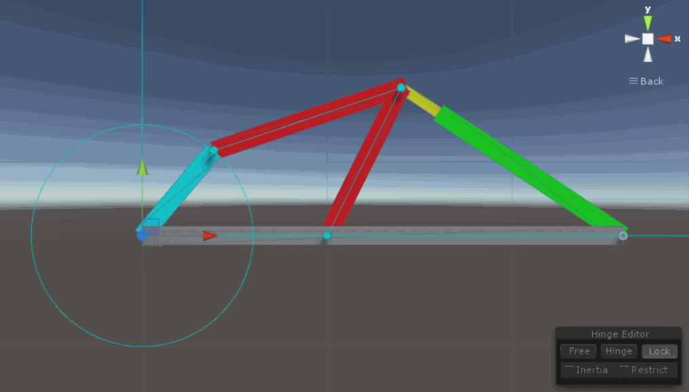

- Crank Slider

- Rocker Spring

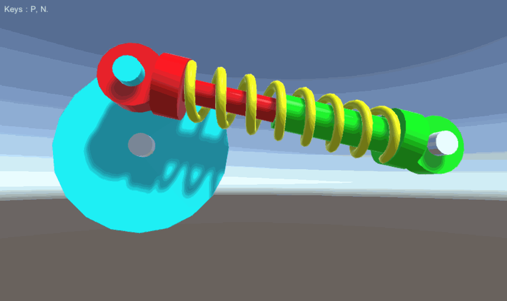

- Extend Mould

- Cross Extender

- Rocker Hinge

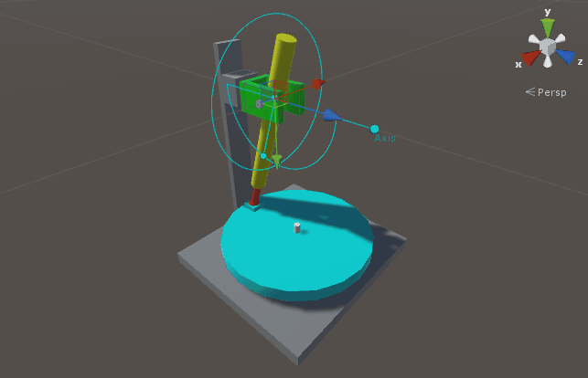

- Internal Gearing

- Airplane Engine

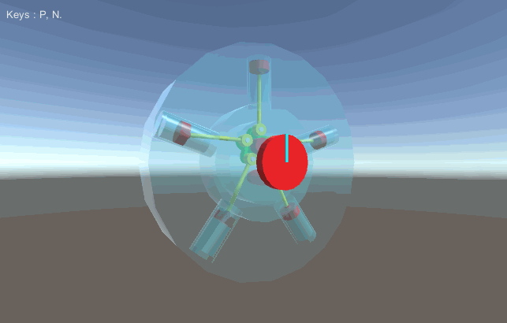

- Gas Engine

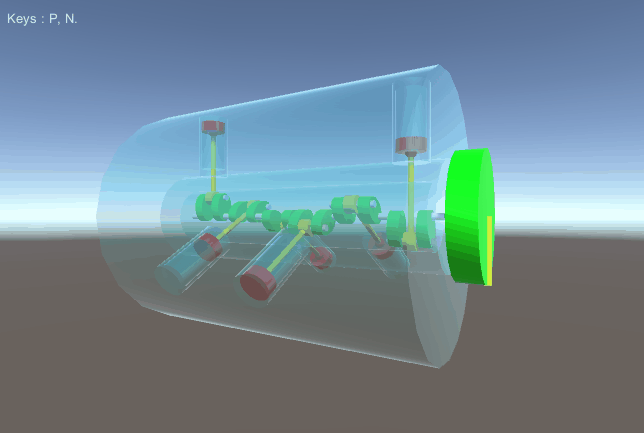

- Crane

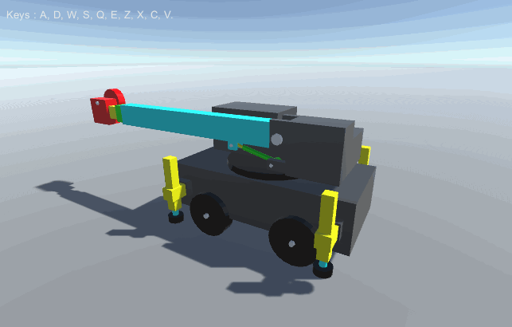

- Road Roller

- Loader

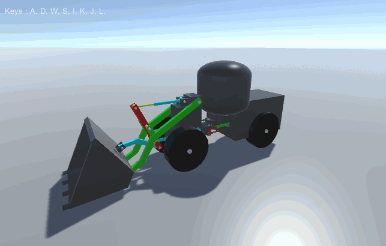

- Grader

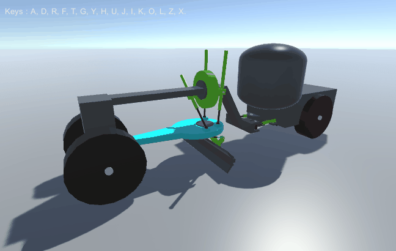

- Excavator

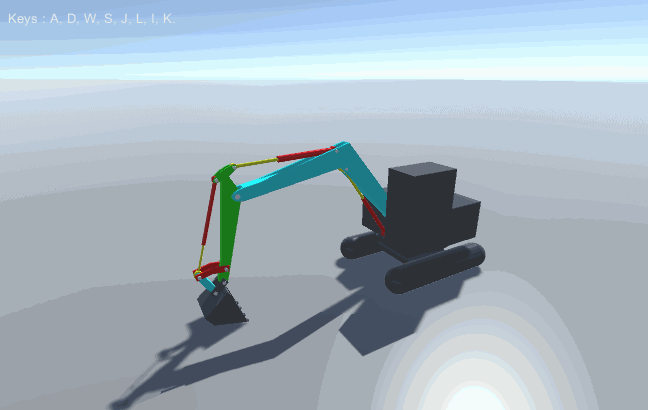

- Dumper

- Dumper

- Helicopter

- Mesh Gears

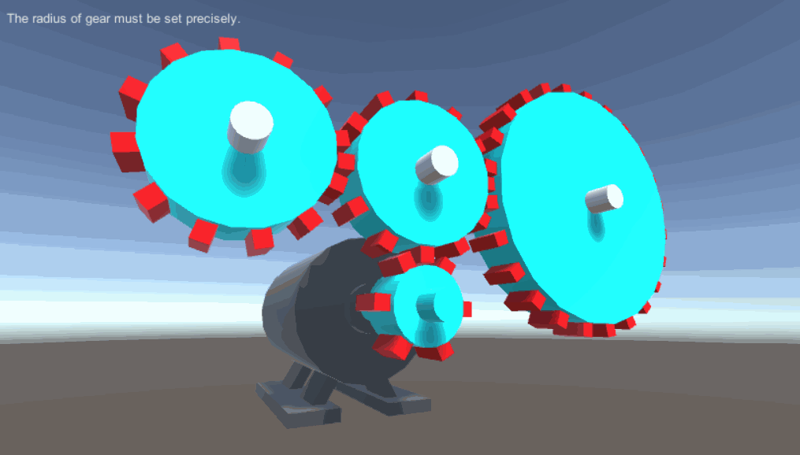

- Mesh Gears

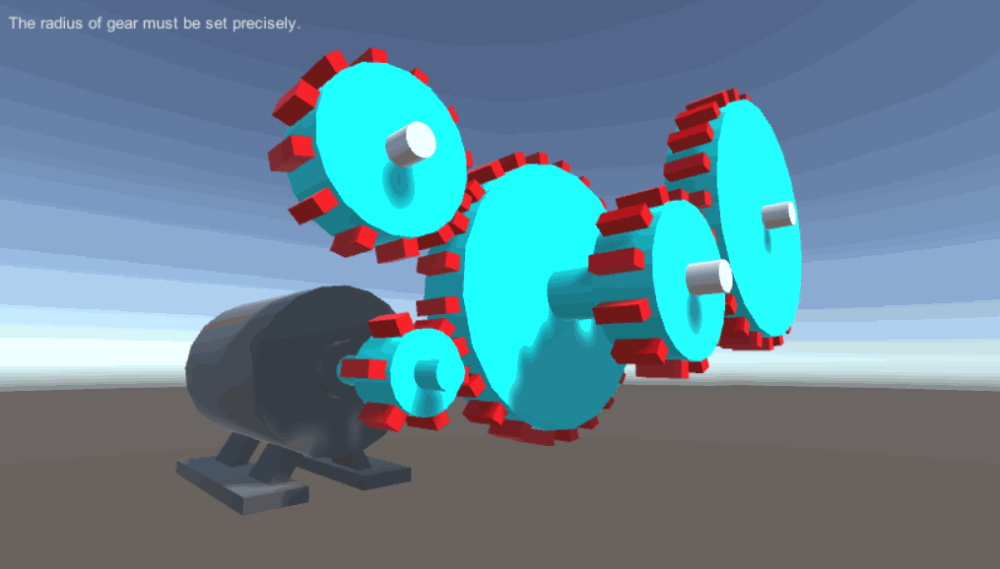

- Belt

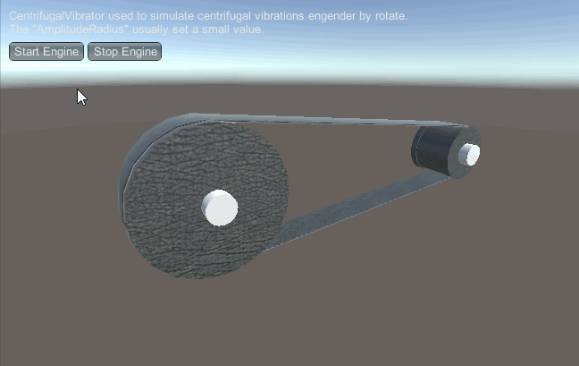

- Worm Gear

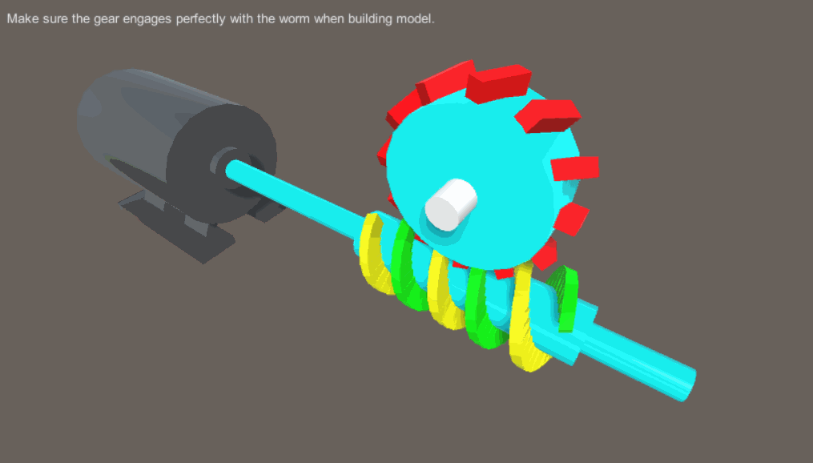

- Vibrosieve

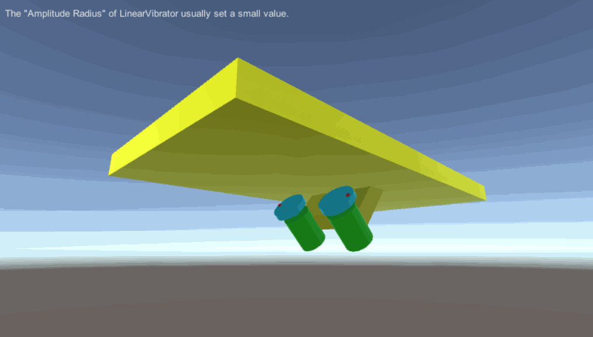

- Differential

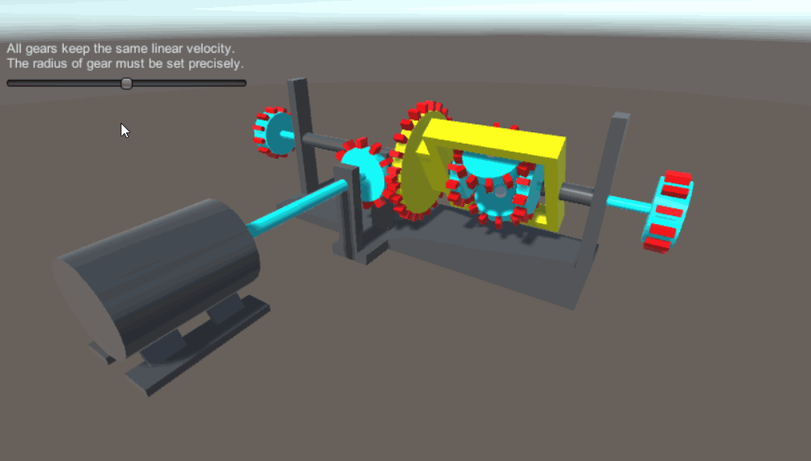

- Transmission

## Contact
- If you have any questions, feel free to contact me at mogoson@outlook.com.
