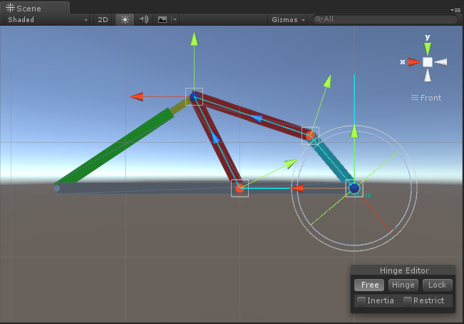
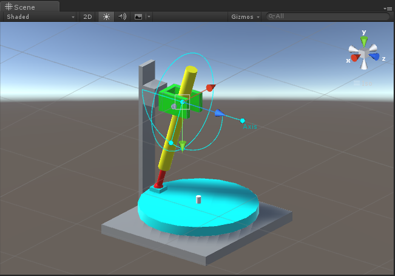
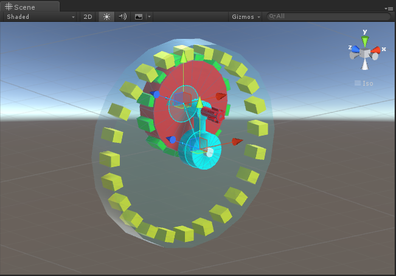
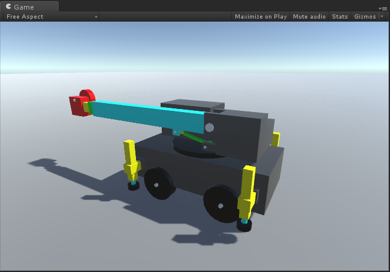
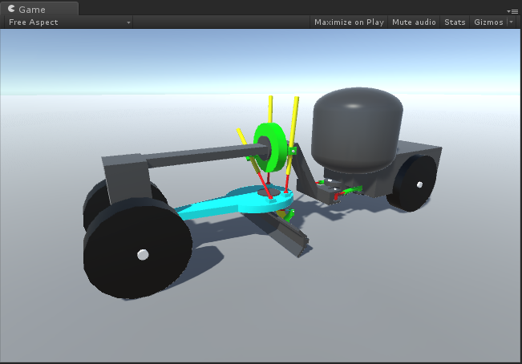

# MGS-Machinery
- [中文手册](./README_ZH.md)

## Summary
- Unity plugin for binding machinery joint in scene.

## Environment
- Unity 5.0 or above.
- .Net Framework 3.0 or above.

## Achieve
- 

## Demo
- Prefabs in the path "MGS-Machinery/Prefabs" provide reference to you.
- Demos in the path "MGS-Machinery/Scenes" provide reference to you.

## Preview
- CrankRocker

- CrankSlider

- RockerHinge

- InternalGearing

- AirplaneEngine

- GasEngine

- Crane

- RoadRoller

- Loader

- Grader

- Excavator

## Contact
- If you have any questions, fell free to contact me at mogoson@qq.com.