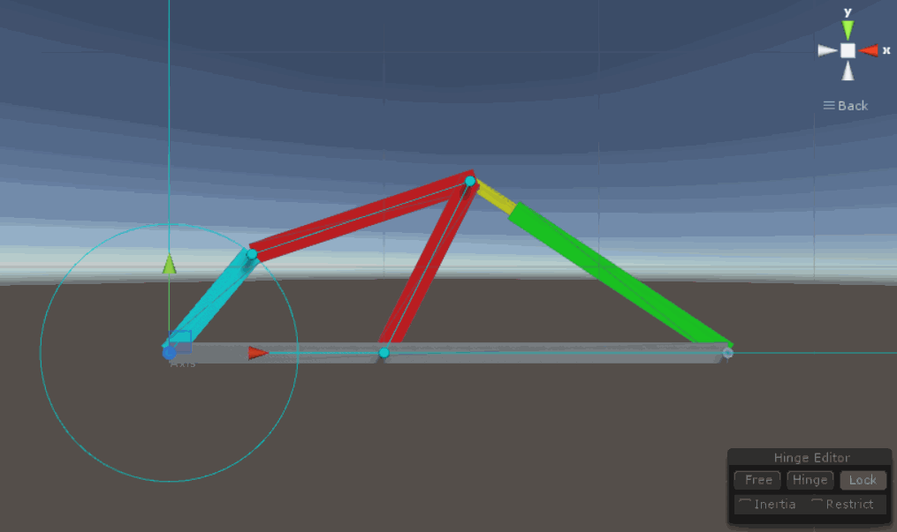
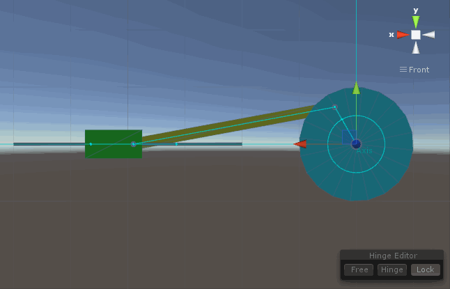
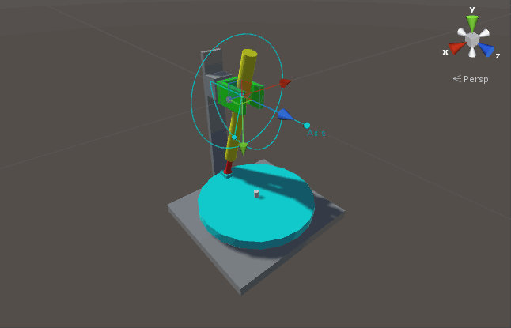
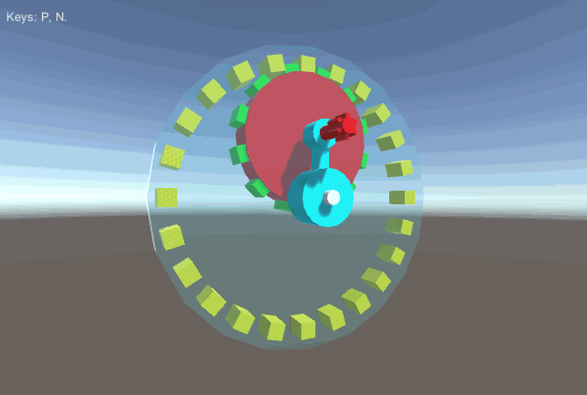
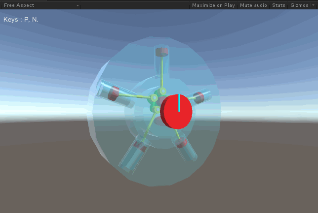
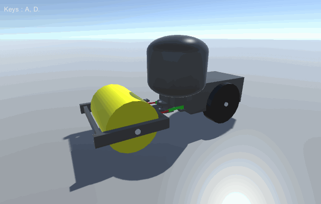

# MGS-Machinery
- [English Manual](./README.md)

## 概述
- Unity绑定机械关节，铰链，机构插件包。

## 需求
- 绑定曲柄，即旋转关节，例如：起重机的上车部分以及大臂部分，外啮合齿轮，内啮合齿轮等。
- 绑定伸缩关节，例如：起重机的伸缩力臂和横向/纵向支腿，压路机的腰部铰接等。
- 绑定液压油缸，例如：挖掘机的力臂驱动油缸，平地机的刮刀偏移驱动油缸等。
- 绑定曲柄摇杆机构，即平面四杆铰链，例如：装载机的铲斗，挖掘机的挖斗等。
- 绑定曲柄滑块机构，例如：往复活塞式内燃机，飞机行星发动机等。
- 绑定完整的工程机械，例如：起重机，压路机，装载机，平地机，挖掘机等。

## 环境
- Unity 5.0 或更高版本。
- .Net Framework 3.0 或更高版本。

## 实现
- Mechanism：机械关节，铰链，机构抽象定义。
- VectorExtension：基于法线计算旋转角度。
- Planimetry：平面几何定义与计算。
- FreeCrank：自由曲柄，绕Z轴自由旋转。
- LimitCrank：受限曲柄，绕Z轴在指定角度范围内旋转。
- CrankRocker：曲柄摇杆机构。
- CrankSlider：曲柄滑块机构。
- RockerHinge：摇杆铰链，随摇杆摆动而旋转(单轴向)。
- RockerJoint：摇杆关节，始终朝向目标关节。
- RockerLock：摇杆限位锁，限定一对摇杆之间的距离范围。
- RockerRivet：摇杆铆钉，始终与目标关节位置（世界坐标）相同。
- TelescopicJoint：伸缩关节。
- CeTelescopicJoint：（基于）中心伸缩关节。
- SeTelescopicArm：（序列）伸缩臂。
- SynchroMechanism：同步机构，同时驱动多个机构运转。
- MeDriver：通用机构驱动器。

## 案例
- “MGS-Machinery/Prefabs”目录下存有上述机械关节和完整机械绑定的预制，供读者参考。
- “MGS-Machinery/Scenes”目录下存有上述机械关节和完整机械绑定的演示案例，供读者参考。

## 预览
- CrankRocker

- CrankSlider

- RockerHinge

- InternalGearing

- AirplaneEngine

- GasEngine

- Crane

- RoadRoller

- Loader

- Grader

- Excavator

## 教程
- 文档（未完成）。
- 视频（未完成）。

## 联系
- 如果你有任何问题或者建议，欢迎通过mogoson@qq.com联系我。